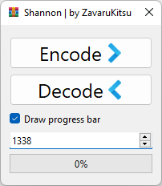

# Shannon compression



## Task

Implement shannon algorithm for file compresion.

## Features

- GUI with progress bar
- Implemented as lib
- XOR supported

## How to run

```shell
git clone https://github.com/ZavaruKitsu/shannon_compression
cd shannon_compression

# setup virtual environment
python -m venv venv
pip install -r requirements.txt

# run gui
python main.py
```

## Project structure

> main.py

Entry point.

> diff.py

File for testing the correctness of (de)compression.

### src

> consts.py

Just a bunch of constants.

> azar.py

Wrapper around writers.

> utils.py

Contains `get_binary_repr` that returns binary representation of any integer (including float).

### src.encoders

> base.py

A bit of abstractions.

> shannon.py

The shannon algorithm itself.

> caesar.py

XOR encryption.

## Credits

- Icons8 for `pack.png, unpack.png, app.ico`
